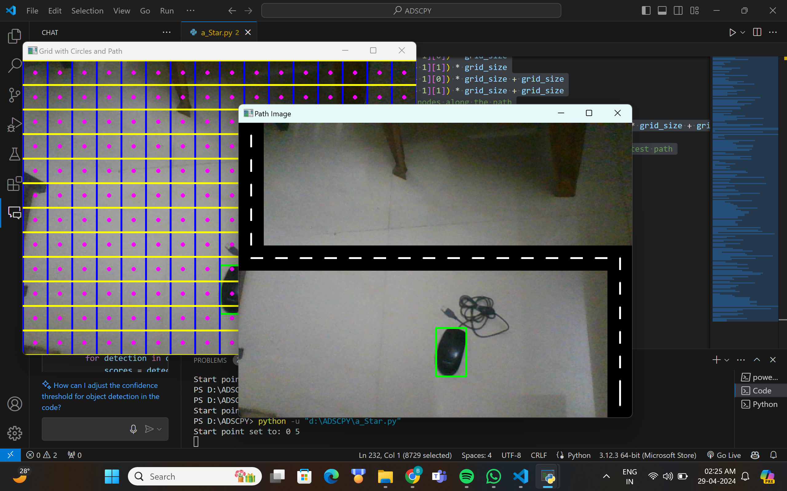

# Realtime-Robotic-Navigation-Shortest-Path-Finder(Object Detection and Pathfinding using A* Algorithm)


This project combines object detection using YOLOv3 and pathfinding using the A* algorithm to find the shortest path from a start point to an end point while avoiding detected obstacles.

## Demo



## Installation

1. Clone the repository:

    ```bash
    git clone https://github.com/your-username/your-repository.git
    ```

2. Install the required dependencies:

    ```bash
    pip install opencv-python numpy
    ```

3. Download the YOLOv3 weights and configuration file from the [official repository](https://pjreddie.com/darknet/yolo/):

## Usage

1. Run the main script:

    ```bash
    python object_detection_pathfinding.py
    ```

2. Click on the video feed window to set the start point (left click) and end point (right click) for the pathfinding algorithm.

3. Press 'q' to exit the program.

## Contributing

Contributions are welcome! If you'd like to improve this project, feel free to fork the repository and submit a pull request. For major changes, please open an issue first to discuss what you would like to change.

